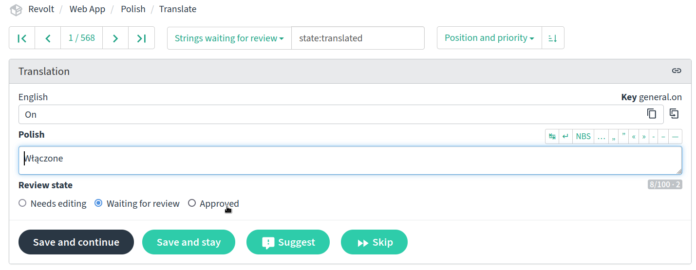

# Revolt Translations

This repository holds all the translation files for Revolt, feel free to help translate to new languages or fix existing translations at [our Weblate instance](https://weblate.insrt.uk/projects/revolt/web-app/).

Please only PR if you are adding new strings to the source language, otherwise contribute through Weblate.

## Languages

The following table shows languages and people enlisted for verifying certain languages are up to standard.

**Note:** This table only includes languages present in-app, [request a language languages to be added here](https://github.com/revoltchat/revite/issues/362).

|   | Language | Maintainers | Contributors |
|:-:|---|---|---|
|🇬🇧|English (Traditional) / en|[@insertish](https://github.com/insertish)||
|🇺🇸|English (Simplified) / en_US|||
|🇸🇦|عربي / ar|[@LedaThemis](https://github.com/LedaThemis)||
|🇮🇳|অসমীয়া / as|||
|🇦🇿|Azərbaycan dili / az|||
|🇧🇾|беларуская / be|||
|🇧🇬|български / bg|||
|🇧🇩|বাংলা / bn|||
|br|Brezhoneg / br|[@SperedAnveliour](https://github.com/SperedAnveliour)||
|🇪🇸|Català / ca|[@TallerThanShort](https://github.com/TallerThanShort)||
|krd|کوردی / ckb|[@fanticwastaken](https://github.com/fanticwastaken)||
|🇨🇿|Čeština / cs|||
|🇩🇰|Danskers / da|||
|🇩🇪|Deutsch / de|[@janderedev](https://github.com/janderedev)||
|🇬🇷|Ελληνικά / el|[@janast3369](https://github.com/janast3369)||
|🇪🇸|Español / es|[@z3ro0k](https://github.com/z3ro0k) [@fernandopal](https://github.com/fernandopal)||
|🇪🇪|eesti / et|[@u032](https://github.com/u032)||
|🇫🇮|suomi / fi|||
|🇵🇭|Pilipino / fil|[@I2rys](https://github.com/I2rys)||
|🇫🇷|Français / fr|[@Hades785](https://github.com/Hades785)||
|🇮🇪|Gaeilge / ga|||
|🇮🇳|हिन्दी / hi|||
|🇭🇷|Hrvatski / hr|||
|🇭🇺|magyar / hu|[@f3rr31](https://github.com/f3rr31)||
|🇮🇩|bahasa Indonesia / id|[@liimee](https://github.com/liimee)||
|🇮🇹|Italiano / it|[@SingleSlice](https://github.com/SingleSlice)||
|🇯🇵|日本語 / ja|[@weasles](https://github.com/weasles)||
|🇰🇷|한국어 / ko|||
|🇱🇺|Lëtzebuergesch / lb|||
|🇱🇹|Lietuvių / lt|[@ErnestasKaralius](https://github.com/ErnestasKaralius)||
|🇲🇰|Македонски / mk|||
|🇲🇾|Melayu / ms|||
|🇳🇴|Norsk bokmål / nb_NO|[@tobggs](https://github.com/tobggs)||
|🇳🇱|Nederlands / nl|||
|🇮🇷|فارسی / fa|[@DevEvil99](https://github.com/DevEvil99)||
|🇵🇱|Polski / pl|[@jacekpoz](https://github.com/jacekpoz) [@Pawelek-dev](https://github.com/Pawelek-dev)||
|🇧🇷|Português (do Brasil) / pt_BR|[@yanndere](https://github.com/yanndere)||
|🇵🇹|Português (Portugal) / pt_PT|[@Tmpod](https://github.com/Tmpod)||
|🇷🇴|Română / ro||[@S703T](https://github.com/S703T)|
|🇷🇺|Русский / ru|[@div2005](https://github.com/div2005)||
|🇸🇰|Slovensky / sk|[@ShadowLp174](https://github.com/ShadowLp174)||
|🇸🇮|Slovenščina / sl|||
|🇷🇸|Српски / sr|||
|🇱🇰|සිංහල / si|||
|🇸🇪|Svenska / sv|[@raggebatman](https://github.com/raggebatman)||
|🇮🇳|தமிழ் / ta|||
|🇹🇭|ไทย / th|||
|🇹🇷|Türkçe / tr|[@KerizAlperwastaken](https://github.com/KerizAlperwastaken)||
|🇺🇦|Українська / uk|[@div2005](https://github.com/div2005)||
|vec|Vèneto / vec|||
|🇻🇳|Tiếng Việt / vi|||
|🇨🇳|中文 (简体) / zh_Hans||[@YouTubeGameNana](https://github.com/YouTubeGameNana)|
|🇹🇼|繁體中文 / zh_Hant|[@Zhuzi-ouo](https://github.com/Zhuzi-ouo)||
|🇱🇻|Latviešu / lv|[@rMazeiks](https://github.com/rMazeiks)||
|🙂|Toki Pona / tokipona|[@Gapva](https://github.com/Gapva)||
|EO|Esperanto / esperanto|||
|😸|OwO / owo|[@janderedev](https://github.com/janderedev) [@FanMclaine](https://github.com/FanMclaine)||
|🏴‍☠️|Pirate / pr|||
|🥺|Bottom / bottom|||
|💾|1337 / leet|||
|🪄|Enchantment Table / enchantment|||
|🐖|Pig Latin / piglatin|||

If you would like to maintain a language, please open an issue with your request.

### What do I do?

As a maintainer you get access to review capabilities on Weblate, this lets you approve strings, edit approved strings and accept new suggestions. You may also be mentioned in GitHub issues to approve badges for others.

If you would like to be removed as a maintainer, please create an issue. (you will remain on the contributions list)

## Coverage

